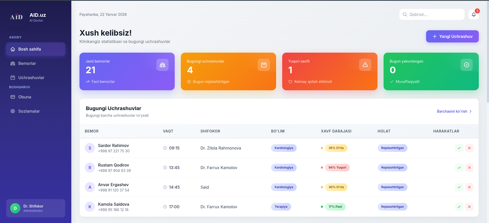
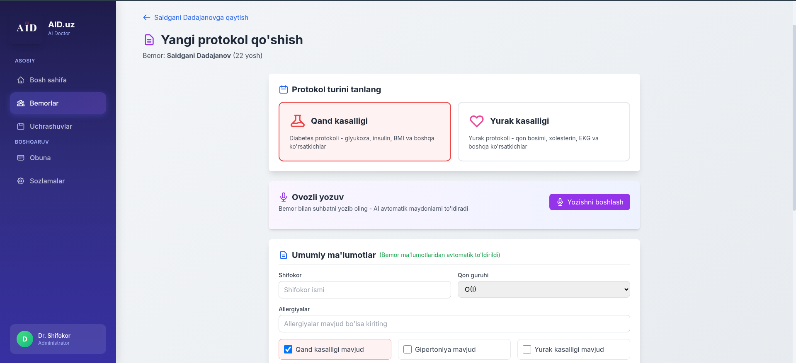
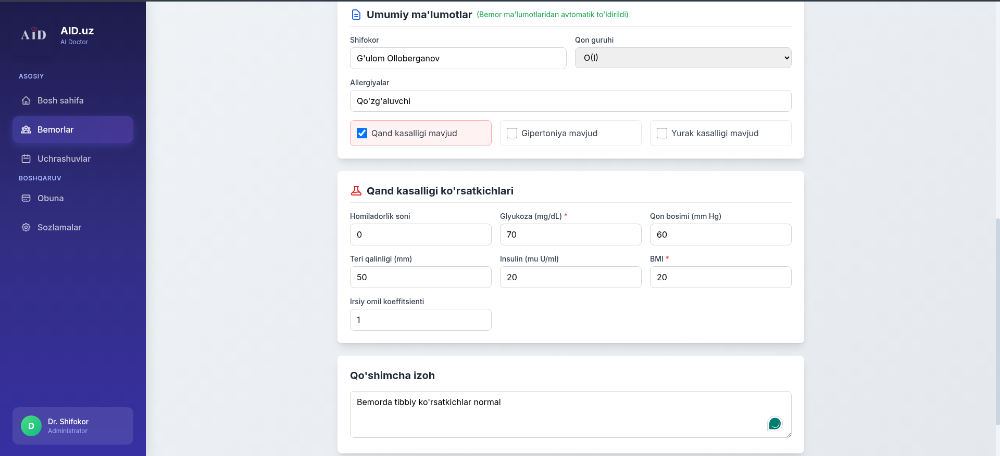
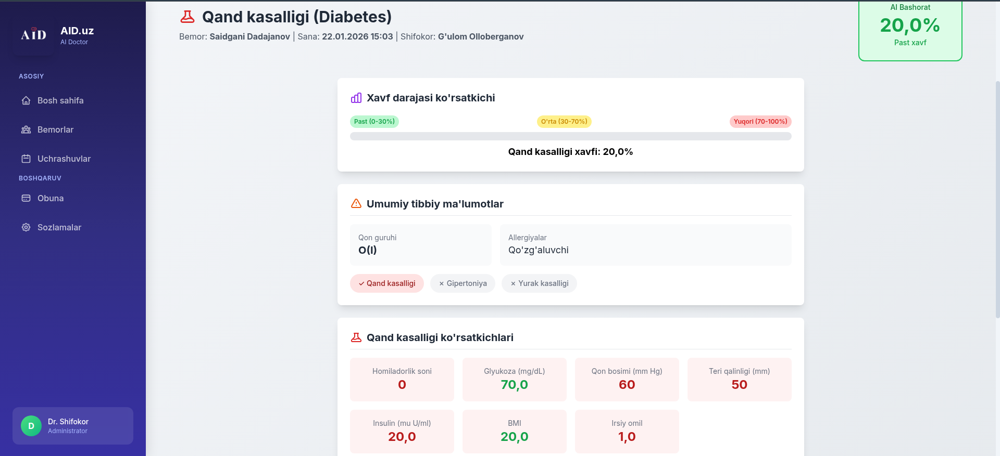

# AID.uz - AI Doctor

O'zbekiston kasalxonalari uchun AI bilan ishlaydigan bemor boshqaruv tizimi.

## Nima qiladi?

- Bemorlarni ro'yxatga olish va boshqarish
- Uchrashuvlarni rejalashtirish
- AI orqali qand va yurak kasalligi xavfini aniqlash
- Ovozli ma'lumot kiritish (ElevenLabs)

## Ishga tushirish

```bash
# Virtual muhit
python3 -m venv venv
source venv/bin/activate

# Paketlar
pip install -r requirements.txt

# Bazani yaratish
python3 manage.py migrate

# Serverni ishga tushirish
python3 manage.py runserver
```

Brauzerda ochish: http://localhost:8000/home/

## Texnologiyalar

- Django 5.0
- scikit-learn (ML modellari)
- Tailwind CSS
- OpenAI, ElevenLabs

## Jamoa

AI Hackathon 2026

## Skrinshotlar








